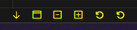

# Toolbar README

A set of frequently used buttons added to the status bar for easy access. Based on [Adam's toolbar extension](https://marketplace.visualstudio.com/items?itemName=AdamAnand.adamstool).

## Features

Buttons:

- [x] Goes to the last cursor position.
- [x] Toggle terminal.
- [x] Unfolds all code currently opened.
- [x] Folds all code currently opened.
- [x] Restarts TS server.
- [x] Restarts Vue server. (Grey if 'Volar' extension is not installed)

> Tip: Many popular extensions utilize animations. This is an excellent way to show off your extension! We recommend short, focused animations that are easy to follow.

## Known Issues

No known issues.

## Release Notes

### 0.0.1

Initial release

---

## Following extension guidelines

Ensure that you've read through the extensions guidelines and follow the best practices for creating your extension.

* [Extension Guidelines](https://code.visualstudio.com/api/references/extension-guidelines)

**Enjoy!**
